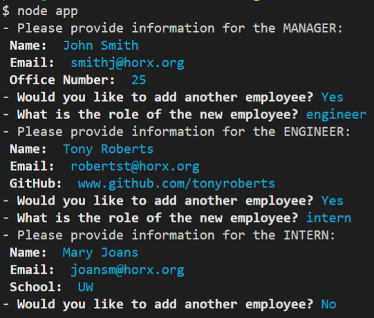

<!-- id: ZEZP8C, version: 1.0.0 -->
# Employee Summary
A node application that will prompt the user for information and use that information to build an HTML document which displays the employee's information as a directory.

---
## 📌 LINKS
[GitHub Repo](https://github.com/ToMakPo/UWCB-10-Employee-Summary) 
[Video Demo](https://tomakpo.github.io/UWCB-10-Employee-Summary/)

---
## 🎯 GOAL
To create a node based application that includes unit tests and inquirer prompts.

---
## ✅ TASKS
- The application should first request infromation about the manager.
- Next it sould continue to give the user the option of adding more employees until all of the employees have been added.
- Create the HTML document and save it to the output file.
- There should be unit tests for each of the classes build for this project.

---
## ⚔️ PROJECT

Before you start the program for the first time, you will need to install the packages by typing `npm i` into the terminal. After the packages are installed, you can start the program.
To start the program, type `node app` into the terminal. This should start the program you should see the first prompt. Follow the prompts until you are finnished adding all of the employees.

When you have added all the employees, an HTML document will be created and added to the output folder.

